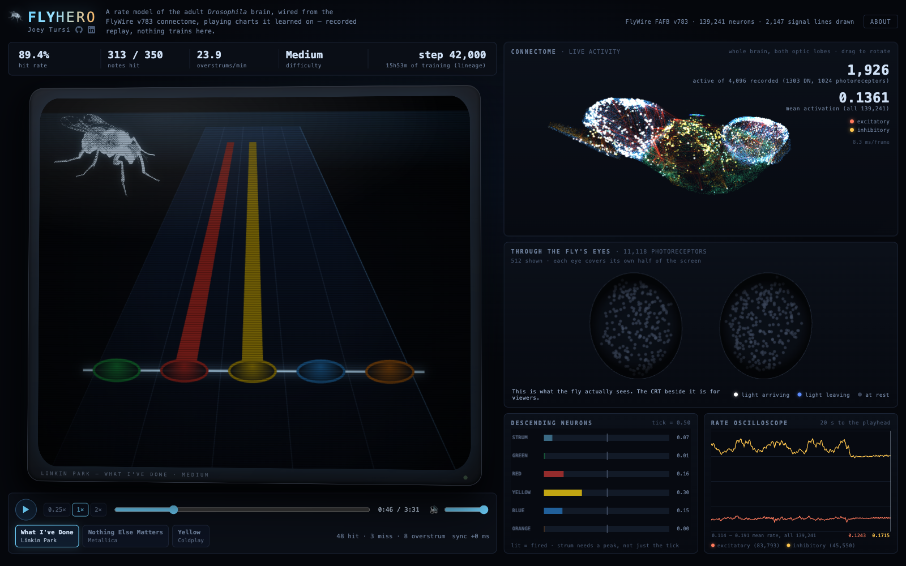
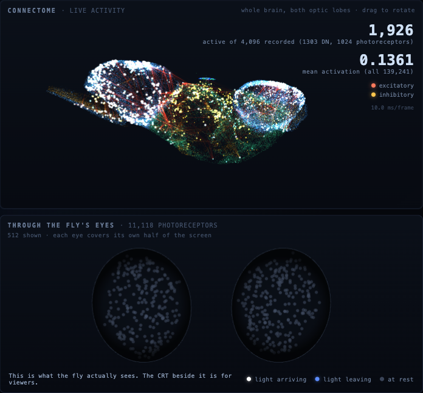
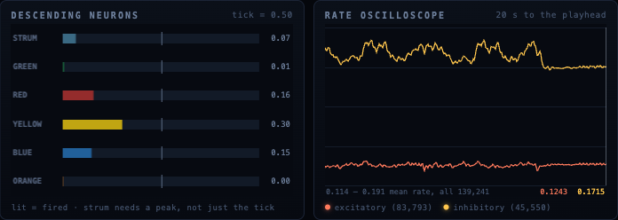
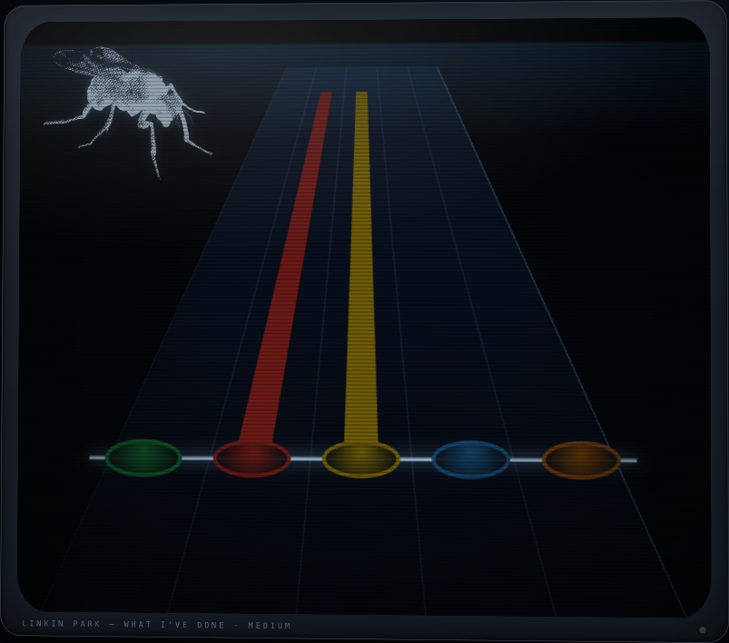
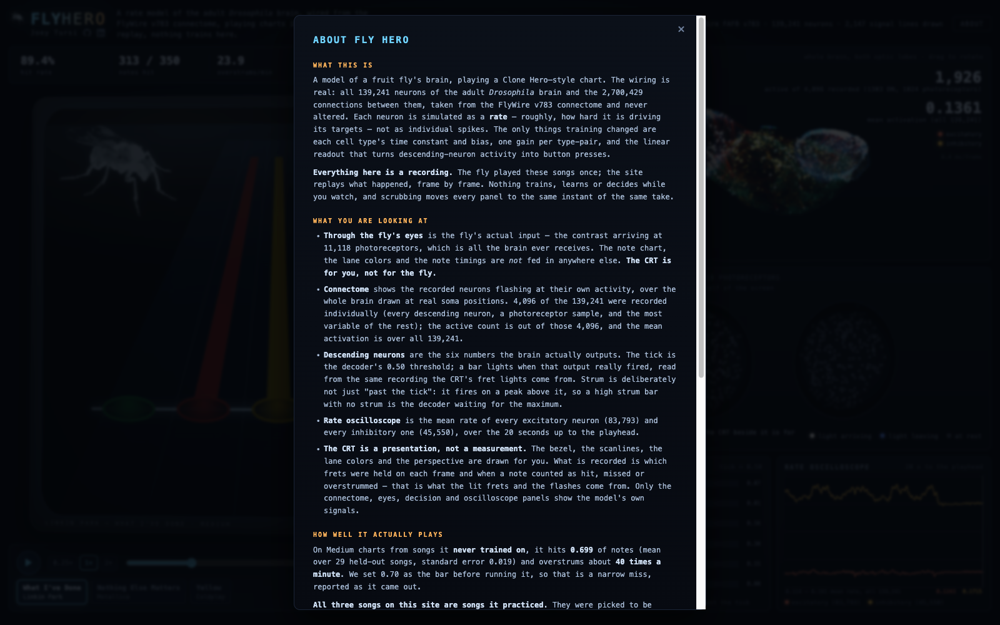
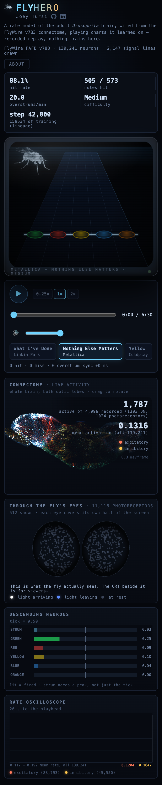

# Fly Brain Hero

**A real fruit fly brain — all 139,241 neurons of it — learns to play Clone Hero.**

The connectome (every neuron and every one of the 2.7M connections between them) comes straight from [FlyWire](https://flywire.ai/)'s FAFB v783 reconstruction of an adult *Drosophila melanogaster* brain, completely unaltered. The only things that ever get trained are each cell type's time constant and bias, one gain per connected type-pair, and a linear readout from descending-neuron activity to the five fret buttons and strum. The brain never sees the chart, the lanes, or the note timings — only contrast hitting a simulated retina, exactly the way a real fly would see a screen.

It was trained on my own local Clone Hero library, in a headless rhythm-game simulator I built from scratch, and three of its best runs are replayed on a live site with the brain's own activity rendered in 3D next to the note highway.

**[→ Watch it play](https://fly-hero-delta.vercel.app)**

<p align="center">
  
</p>

---

## What am I looking at

Every panel on the site is a **recording**, not a live simulation — the fly played each song once, offline, on my own machine, and the site scrubs through exactly what happened, frame by frame. Nothing trains, learns, or decides while you watch.

| | |
|---|---|
|  | **Connectome** — all 139,241 neurons at their real anatomical soma positions, 4,096 of them recorded individually and shown flashing at their own activity. **Through the fly's eyes** — the fly's actual input: contrast arriving at 11,118 photoreceptors, one dot per cell. This is the *only* thing that ever reaches the brain — no chart data, no lane colors, no note timings, anywhere else. |
|  | **Descending neurons** — the six numbers the brain's readout actually outputs (five frets + strum), with the decoder's threshold marked. **Rate oscilloscope** — mean firing rate of every excitatory (83,793) and every inhibitory (45,550) neuron in the brain, scrolling live. |

<details>
<summary><b>The CRT and the About panel</b> (click to expand)</summary>
<br>

The note highway itself — the CRT, the lane colors, the perspective, the scanlines — is a presentation built for *you*, not for the fly. What's actually recorded is which frets were held each frame and whether a note was hit, missed, or overstrummed; that's what drives the lit frets and the flashes.

 

The site also ships an About panel that states its own honest numbers up front — including the one gate this project narrowly missed. See [Results](#results) below for the same numbers.

</details>

<details>
<summary><b>Mobile</b> (click to expand)</summary>
<br>

</details>

---

## How it works

```
Clone Hero chart (.chart / .mid)
        │
        ▼
 headless rhythm-game simulator ──► scripted "perfect" expert player (behavior-cloning target)
        │
        ▼
 biologically-grounded retina encoder            ← the ONLY input the brain ever receives
   (11,118 photoreceptors, real optic anatomy)
        │
        ▼
 connectome-constrained rate model                ← topology, synapse counts, edge signs: FIXED
   139,241 neurons · 2.7M synaptic connections        trainable: per-type τ & bias, per-type-pair gain
        │
        ▼
 linear readout (weights + bias)                  ← the ONLY thing that produces an action
   descending-neuron activity → 5 frets + strum
        │
        ▼
 replayed showcase runs ──► exported to a three.js + Tone.js site on Vercel
```

**The constraint that makes this interesting:** the wiring is never touched. Connectome topology, synapse counts, and edge signs (excitatory/inhibitory, from FlyWire's predicted neurotransmitter) are fixed throughout training — nothing is added, pruned, or rewired. What the model actually learns is how hard each of the ~9,000 cell types drives and responds (`tau`, `bias`), how strongly each connected pair of types influences each other (`gain`, via softplus so it's always positive), and how to read five buttons' worth of decision out of descending-neuron traffic. It's the fly's own brain, tuned, not a neural network shaped like a brain.

**Training** is behavior cloning against a scripted, deterministic "perfect" player (`hit_rate = 1.000` on held-out Expert charts) that reads the chart directly — the brain never sees that data, only the retina's contrast. Songs are split by song (not by difficulty) into train/val/test, so a song's Easy and Medium charts never straddle a split. A watchdog (`train/watchdog.py`) catches and rolls back the rare gradient blow-up mid-run, halving the learning rate and restoring the last healthy checkpoint — this ran unattended overnight for most of its ~16 hours of total training.

**Two controls run the identical training code path, config, and budget as the real model:**
- a conventional CNN + GRU baseline that sees the *rendered frame* instead of the retina, to check the game itself is learnable;
- a readout-only control (the connectome frozen, only the linear readout trained), which — as expected — never progresses past the easiest curriculum stage, showing the connectome's own dynamics are doing real work, not just providing a random-projection feature space.

<details>
<summary><b>More detail: the simulator, the retina, and the rules</b></summary>
<br>

- **Simulator** (`flyhero/game/`) is a from-scratch Clone Hero–style engine — `.chart`/`.mid` parsing, note/sustain/overstrum scoring, and a Gymnasium-style env — with exactly **one** implementation of the scoring rules (`rules.py`), shared by training, evaluation, and the showcase export, so nothing can silently diverge between what's trained and what's shown.
- **Retina** (`flyhero/game/retina.py`, `retina_torch.py`) projects the rendered game frame onto each of the 11,118 photoreceptors' real retinotopic position, calibrated against the connectome's own optic-lobe columnar anatomy (matched-pair validation: neighboring photoreceptors that anatomically share input differ in projected position by a median of 1.6 lattice spacings, vs. 22.6 for random pairs).
- **Brain** (`flyhero/brain/rate_model.py`) is a rate-coded (not spiking) simulation: each neuron's state is a continuous firing rate integrated over discrete per-cell-type time constants, not individual action potentials.

</details>

---

## Results

| Gate | What it measures | Result |
|---|---|---|
| **G1** — connectome graph | Nodes / edges / DNs / photoreceptors built from FlyWire v783 | **139,241 neurons**, **2,700,429 edges** (≥5 synapses), **1,303 descending neurons**, **11,118 photoreceptors** |
| **G2** — simulator | Scripted-expert `hit_rate` on real Expert charts; env throughput | **1.000** hit rate, 0 misses/overstrums on 25 Expert charts; **6.8×** real-time simulation throughput |
| **G3** — brain stability | Full retina→brain→readout pipeline: runtime, memory, activity regime | **0.85 s** fwd+bwd/batch on Apple Silicon MPS, **24.3 GiB** peak; 24.7% of non-photoreceptor neurons active in a healthy dynamic range |
| **G4** — held-out skill | Mean hit rate on **Medium charts from songs never trained on** (29 held-out test songs) | **0.699** ± 0.019 SE — a narrow miss of the 0.70 bar set before training, reported as-is |
| **G6** — export fidelity | Re-scoring the exported showcase recordings against the same rules used in training | **Exact match**, zero difference, on all 3 showcase songs |

The three showcase songs on the live site are ones the fly *practiced on* — picked because they're watchable, and they flatter it (0.88–0.91 hit rate). **The honest, apples-to-apples number for a song it's never seen is 0.699**, and the site's own About panel says so, unprompted, right next to the pretty numbers. I'd rather ship an accurate self-assessment than a cherry-picked one.

Full gate-by-gate numbers, every deviation, and every fallback decision are logged in [`docs/PROGRESS.md`](docs/PROGRESS.md); every locked design decision (down to *why* a bias default had to move to make any neuron fire at all) is in [`docs/DECISIONS.md`](docs/DECISIONS.md) — 62 decisions and counting, kept as a real paper trail rather than tidied up after the fact.

---

## Try it

**[fly-hero-delta.vercel.app](https://fly-hero-delta.vercel.app)** — no login, no build step, just open it. Scrub the timeline, switch songs, watch the fly's actual eyes next to the CRT built for you.

---

## Tech stack

| | |
|---|---|
| **Brain / training** | Python 3.12, PyTorch (MPS backend, float32), `uv` for dependency management |
| **Simulator** | A from-scratch Clone Hero–style engine — chart parsing (`mido` for MIDI), scoring, Gymnasium env |
| **Data** | polars / pyarrow for the song-library pipeline; TensorBoard for training curves |
| **Site** | Vite + TypeScript + three.js (WebGL connectome + retina rendering) + Tone.js, deployed to Vercel |
| **Testing** | `pytest` (160+ tests) on the Python side; Playwright-driven visual/behavioral checks (including a real-mouse-click pause-button regression suite, run against **both Chromium and WebKit**) on the site |

---

## Repo layout

```
flyhero/
├── connectome/   # download FlyWire v783, build the trainable graph, inspect, shuffle (control)
├── library/      # read-only local Clone Hero library scan
├── game/         # chart/MIDI parsing, scoring rules, retina encoder, Gymnasium env, debug video
├── brain/        # the rate-coded connectome model, GRU baseline, linear readout
├── train/        # behavior cloning, the gradient watchdog, readout-only control
├── eval/         # held-out evaluation
└── export/       # showcase recording + export for the web site
configs/          # every entry point takes one of these
docs/             # PLAN.md, PROGRESS.md, DECISIONS.md — the full build log
scripts/          # gate-check and status scripts
tests/            # pytest suite
web/              # the three.js + Tone.js replay site (this is what's deployed)
```

- [`docs/PLAN.md`](docs/PLAN.md) — the phase-by-phase build plan, gates, and fallbacks, written *before* starting.
- [`docs/PROGRESS.md`](docs/PROGRESS.md) — what actually happened, gate numbers, every deviation from the plan.
- [`docs/DECISIONS.md`](docs/DECISIONS.md) — an append-only log of every locked design decision and why.

## Running it locally

You'll need [`uv`](https://docs.astral.sh/uv/), Python 3.12, `ffmpeg`, Node.js, and your own local Clone Hero song library (this repo never ships or commits chart files or non-showcase audio — see [Data and credits](#data-and-credits)).

```bash
uv sync

# point at your own library (gitignored)
echo 'song_library: "/path/to/your/Clone Hero/songs"' > configs/paths.yaml

# build the connectome graph (downloads FlyWire v783)
uv run python -m flyhero.connectome.download --config configs/connectome.yaml
uv run python -m flyhero.connectome.build_graph --config configs/connectome.yaml

# scan and ingest your song library
uv run python -m flyhero.library.scan --config configs/paths.yaml
uv run python -m flyhero.game.ingest --config configs/game.yaml

# run the test suite
uv run pytest -q
```

```bash
# the web site
cd web
npm install
npm run dev      # local dev server
npm run build    # production build, matches what's deployed
```

Full training/eval/export commands, plus `fly.sh` (a training-run control script — check status, stop, resume, guard against crashes, render debug videos) are documented in [`docs/PROGRESS.md`](docs/PROGRESS.md) and `CLAUDE.md`.

## Data and credits

The connectome is [FlyWire](https://flywire.ai/) FAFB v783 — Dorkenwald et al. 2024, *Nature* (whole-brain connectome), and Schlegel et al. 2024, *Nature* (cell-type annotations) — used under **CC BY 4.0**.

Clone Hero charts were played from my own local library and are never redistributed; only the full-mix audio for the three showcase songs is committed, as a deliberate, revisit-before-public exception. This project is not affiliated with, endorsed by, or connected to Clone Hero or Guitar Hero.

---

Built solo, end-to-end — connectome pipeline, anatomically-calibrated retina, rate-coded brain simulator, behavior-cloning training loop with an overnight-safe gradient watchdog, and the replay site above — over one week.
